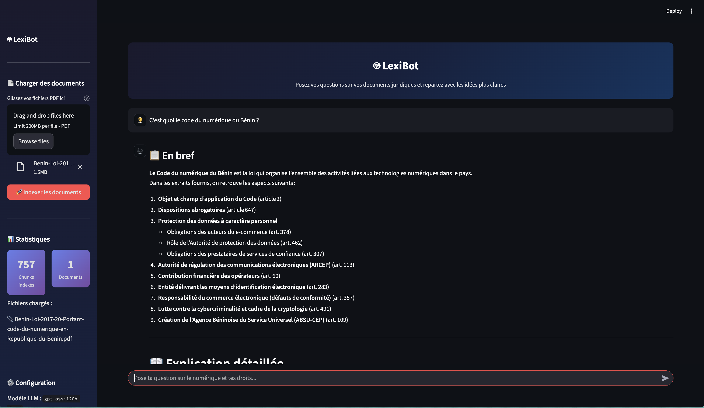
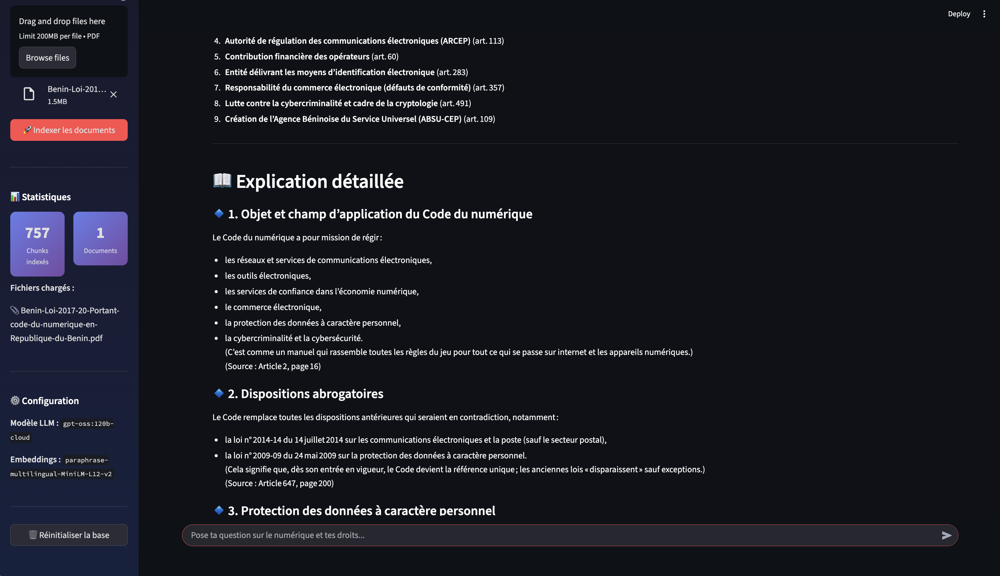
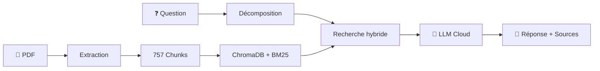

# 🤖 LexiBot — Tes droits numériques, expliqués simplement

LexiBot est un chatbot **RAG** (Retrieval-Augmented Generation) qui répond à vos questions sur des documents juridiques PDF. Posez une question en langage courant, LexiBot retrouve les articles pertinents et vous les explique clairement, avec les sources.

> 🎯 **Cas d'usage** : Comprendre le [Code du Numérique du Bénin](https://fr.wikipedia.org/wiki/Code_du_num%C3%A9rique_(B%C3%A9nin)) — 200+ pages de loi, décryptées par l'IA.





---

## ✨ Fonctionnalités

- 📄 **Upload de PDF** — Chargez n'importe quel document juridique
- 🔍 **Recherche hybride** — Sémantique (embeddings) + mots-clés (BM25) pour ne rater aucun article
- 🧠 **Décomposition multi-requête** — Le LLM décompose votre question en sous-requêtes pour couvrir tous les aspects
- 📊 **Diversification des sources** — Priorise des résultats de chapitres différents
- 💬 **Réponses structurées** — Organisées par thème avec sources citées
- ⚡ **LLM Cloud** — Utilise un modèle cloud pour des réponses rapides et pertinentes

---

## 🏗️ Architecture RAG

```
1. INDEXATION   : PDF → Extraction texte → Découpage en chunks → Vectorisation + BM25
2. QUESTION     : Question → Décomposition en 3 sous-requêtes par le LLM
3. RECHERCHE    : 4 requêtes × recherche hybride → 20 extraits diversifiés
4. GÉNÉRATION   : Extraits + Question → LLM → Réponse structurée par thèmes
```



---

## 🚀 Installation (local)

### Prérequis

- Python 3.10+
- Un compte [Groq](https://console.groq.com) (gratuit) **ou** [Ollama](https://ollama.com/) installé

### Étapes

```bash
# 1. Cloner le projet
git clone https://github.com/Abd2k27/LexiBot---RAG.git
cd LexiBot---RAG

# 2. Installer les dépendances
pip install -r requirements.txt

# 3. Configurer l'environnement
cp .env.example .env
# Éditez .env : ajoutez votre clé API Groq (ou configurez Ollama)

# 4. Lancer l'application
streamlit run app.py
```

L'application sera accessible sur `http://localhost:8501`.

---

## ☁️ Déploiement sur Streamlit Cloud

### 1. Obtenir une clé API Groq (gratuit)

1. Allez sur [console.groq.com](https://console.groq.com)
2. Créez un compte (gratuit, sans carte bancaire)
3. Allez dans **API Keys** → **Create API Key**
4. Copiez la clé

### 2. Déployer

1. Allez sur [share.streamlit.io](https://share.streamlit.io)
2. Connectez votre repo GitHub `Abd2k27/LexiBot---RAG`
3. Sélectionnez `app.py` comme fichier principal
4. Cliquez sur **Deploy**

### 3. Configurer les secrets

Dans les **Settings > Secrets** de votre app Streamlit Cloud, ajoutez :

```toml
LLM_PROVIDER = "groq"
GROQ_API_KEY = "gsk_votre_clé_ici"
GROQ_MODEL = "llama-3.3-70b-versatile"
```

---

## ⚙️ Configuration

Tous les paramètres sont dans `config.py` :

| Paramètre | Défaut | Description |
|-----------|--------|-------------|
| `TOP_K_RESULTS` | `20` | Nombre de sources récupérées par question |
| `MAX_CHUNK_SIZE` | `1500` | Taille max d'un chunk (caractères) |
| `SIMILARITY_THRESHOLD` | `0.3` | Seuil de pertinence (0-1) |
| `MULTI_QUERY_COUNT` | `3` | Sous-requêtes générées par question |
| `LLM_TEMPERATURE` | `0.1` | Créativité du LLM (bas = précis) |

---

## 📁 Structure du projet

```
lexibot/
├── app.py              # Interface Streamlit (UI)
├── rag_pipeline.py     # Chef d'orchestre RAG
├── vector_store.py     # Recherche hybride (ChromaDB + BM25)
├── chunker.py          # Découpage intelligent des textes juridiques
├── pdf_parser.py       # Extraction de texte depuis les PDFs
├── config.py           # Configuration centralisée (st.secrets + .env)
├── requirements.txt    # Dépendances Python
├── packages.txt        # Dépendances système (Streamlit Cloud)
├── .env.example        # Template des variables d'environnement
├── .streamlit/
│   └── config.toml     # Thème Streamlit
└── .gitignore
```

---

## 🔬 Comment ça marche ?

### Recherche hybride

LexiBot combine **deux méthodes** de recherche pour ne rater aucun article pertinent :

| Méthode | Force | Faiblesse |
|---------|-------|-----------|
| **Sémantique** (ChromaDB) | Comprend le sens, même avec des mots différents | Peut rater des mots-clés exacts |
| **BM25** (mots-clés) | Trouve les correspondances exactes | Ne comprend pas les synonymes |

Le score final fusionne les deux : `score = sémantique × 60% + BM25 × 40%`

### Décomposition multi-requête

Pour une question large comme *"Quelles lois respecter sur les réseaux sociaux ?"*, le LLM la décompose en sous-requêtes couvrant des angles différents :
- 🔹 Droit d'auteur et propriété intellectuelle
- 🔹 Données personnelles et vie privée
- 🔹 Responsabilité pénale et cyberharcèlement

Chaque sous-requête lance sa propre recherche hybride → couverture maximale.

---

## 🛠️ Technologies

- **[Streamlit](https://streamlit.io/)** — Interface web interactive
- **[ChromaDB](https://www.trychroma.com/)** — Base de données vectorielle
- **[Sentence Transformers](https://www.sbert.net/)** — Embeddings multilingues
- **[BM25](https://en.wikipedia.org/wiki/Okapi_BM25)** — Recherche par mots-clés
- **[Ollama](https://ollama.com/)** — Serveur LLM local/cloud
- **[PyMuPDF](https://pymupdf.readthedocs.io/)** — Extraction de texte PDF

---

## 📝 Licence

Ce projet est un projet personnel à but éducatif.

---

*Fait avec ❤️ pour démocratiser l'accès au droit numérique.*
